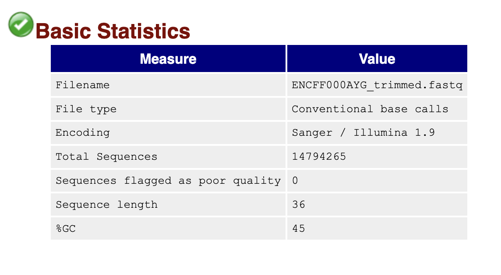
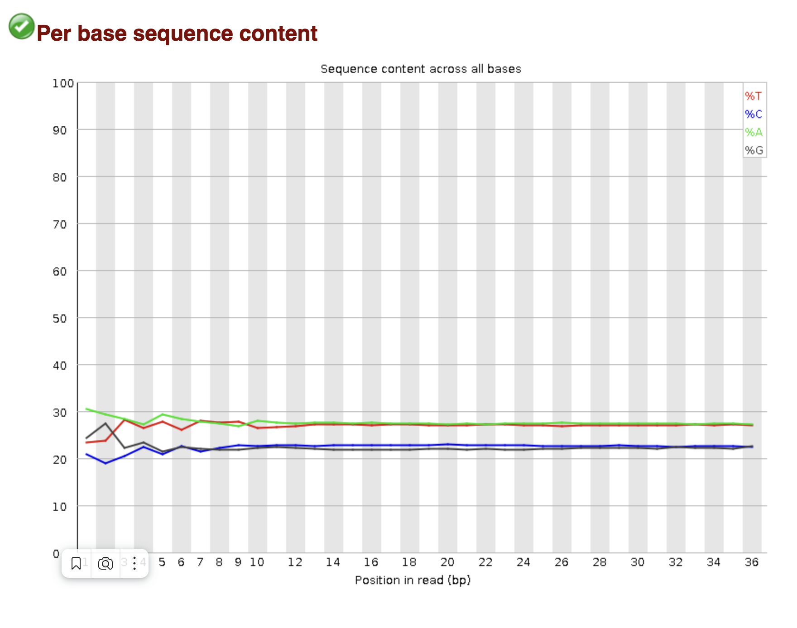

# Домашнее задание 2 по биоинформатике (4 семестр)

[Ссылка на колаб](https://colab.research.google.com/drive/1hMmR_Lp92oJ4G5Y-DVietc9L2B8a77wq?usp=sharing)

## FastQC

Качество чтений оказалось не лучшим, и их пришлось подрезать. Отчеты по подрезанным чтениям:

### ENCFF000AYG

### ENCFF000AYH

### ENCFF036EGF

## Статистика по выравниваниям

Для ENCFF000AYG из 21858810 чтений не выровнено 18639382 (85.27%), выровнено уникально 780096 (3.57%), выровнено неуникально 2439332 (11.16%).

Для ENCFF000AYH из 20411717 чтений не выровнено 17319434 (84,85%), выровнено уникально 755999 (3.70%), выровнено неуникально 2336284 (11.45%)

Для ENCFF036EGF (контроля) из 19175466 чтений не выровнено 15342916 (80.01%), выровнено уникально 854654 (4.46%), выровнено неуникально 2977896 (15.53%)

Такой низкий процент выравниваний легче всего объяснить тем, что мы выравнивали всего на одну небольшую хромосому.

## Диаграммы

